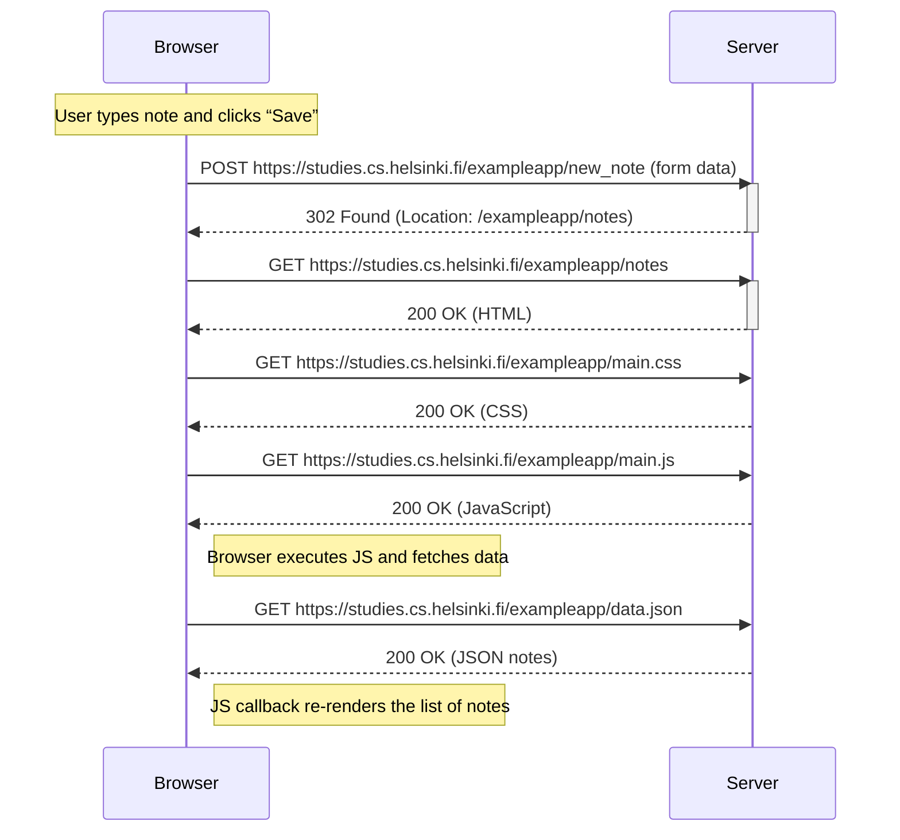

# 0.4 – New note (classic Notes page)

**Key idea:** The form submits with a normal HTTP POST to `new_note`, the server answers with a `302` redirect to `/notes`, and the browser **fully reloads** HTML/CSS/JS and then refetches JSON before re-rendering.

