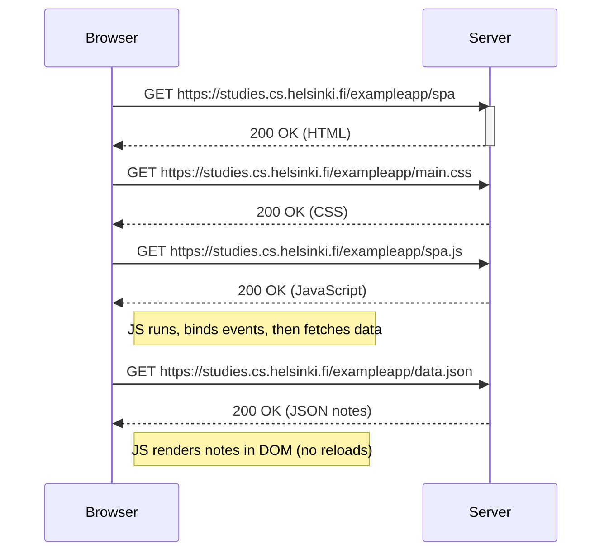

**part0/0.5-spa-load-diagram.md**
# 0.5 – Single Page App load

**Key idea:** The SPA loads a different JS file (`spa.js`). After the initial HTML/CSS/JS, it fetches JSON and renders **without** full page reloads.

