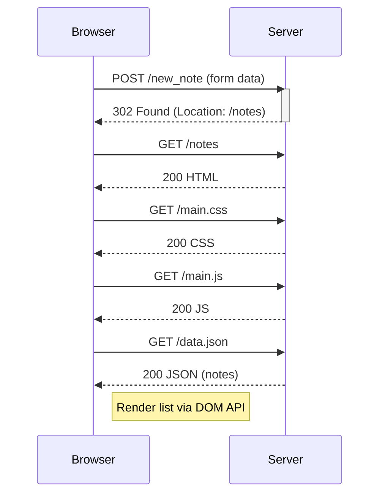

# 0.4 – New note (classic notes page)

Key idea: form submit → POST /new_note → 302 redirect → page reload → CSS/JS/data fetched again.

```mermaid
sequenceDiagram
  participant B as Browser
  participant S as Server
  B->>S: POST /new_note (form data)
  activate S
  S-->>B: 302 Found (Location: /notes)
  deactivate S
  B->>S: GET /notes
  S-->>B: 200 HTML
  B->>S: GET /main.css
  S-->>B: 200 CSS
  B->>S: GET /main.js
  S-->>B: 200 JS
  B->>S: GET /data.json
  S-->>B: 200 JSON (notes)
  Note right of B: Render list via DOM API
```
