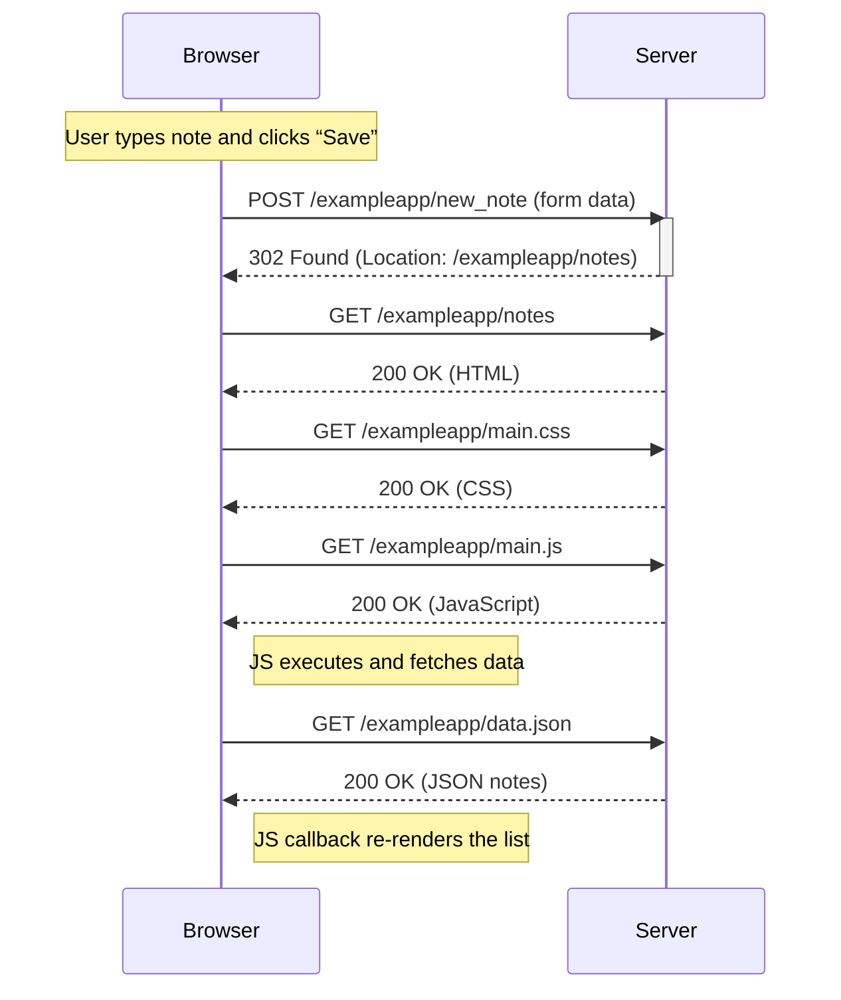
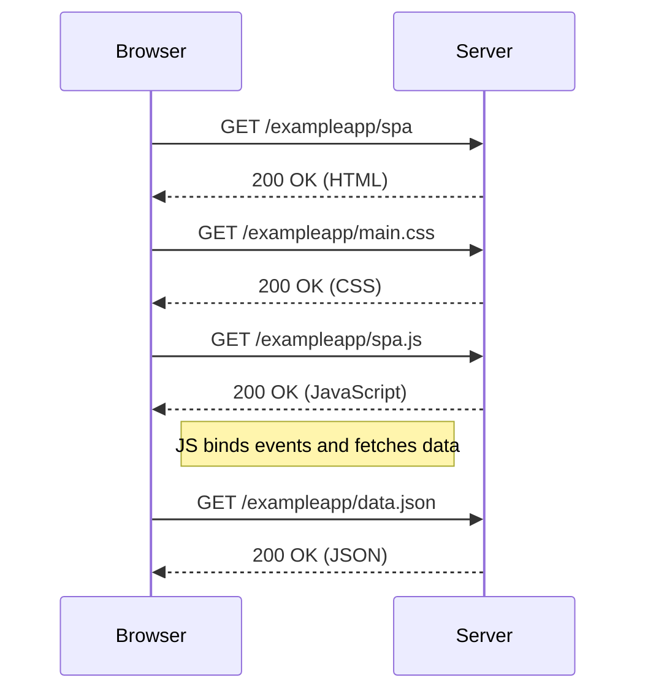
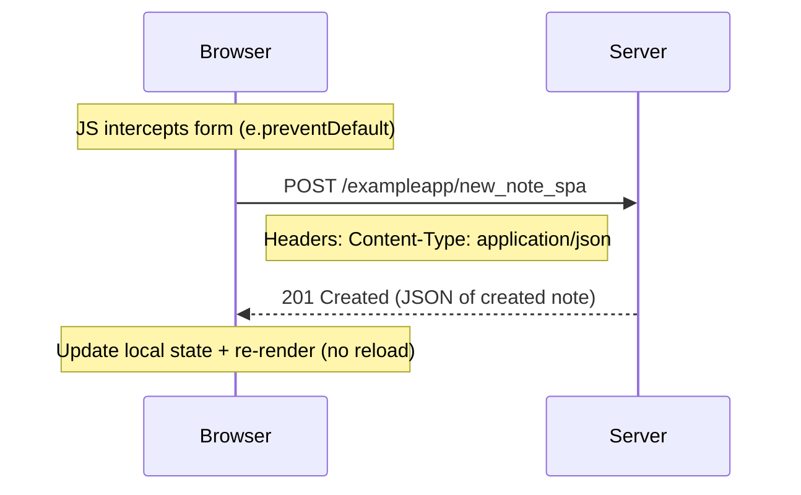

# Day Study Log — Part 0: Fundamentals of Web Apps (Full Stack Open) — 2025-09-30

Repository: **itsnothuy/FullStackOpen-Dairy**  
Course: [Full Stack Open](https://fullstackopen.com/en/) → Part 0: [Fundamentals of Web apps](https://fullstackopen.com/en/part0/fundamentals_of_web_apps)

---

## What I accomplished today
- ✅ Read and understood **Part 0: Fundamentals of Web apps**.
- ✅ Completed exercises **0.1 → 0.6** (HTML, CSS, forms, and three sequence/SPA diagrams).
- ✅ Practiced with **Chrome DevTools → Network/Console/Elements** to verify the request/response flow and DOM updates.
- ✅ Wrote **Mermaid** sequence diagrams and daily notes in this repo.
  - Files created: `part0/0.4-new-note-sequence.md`, `part0/0.5-spa-load-diagram.md`, `part0/0.6-spa-new-note-sequence.md`.
- ✅ Captured a **TIL** (Today I Learned) entry for recall and spaced review.

> These steps follow the Part 0 material’s guidance to explore the example app and use DevTools to inspect HTTP, HTML/CSS, JavaScript, and JSON flows. fileciteturn1file0

---

## Key concepts I verified (hands-on)
### 1) How a traditional page load works
- The browser sends an **HTTP GET** for the page HTML; the HTML then triggers more GETs (e.g., `main.css`, `main.js`, images). The browser uses **headers like `Content-Type`** to decide how to render responses. fileciteturn1file0  
- I verified this in DevTools **Network** panel (disable cache + preserve log) and confirmed multiple requests and `200 OK` responses. fileciteturn1file0  citeturn0search5

### 2) DOM & the Console
- The **DOM** is the page’s tree structure; JavaScript can create elements (e.g., `ul`/`li`) and attach them. I practiced adding an extra list item with `appendChild`, and observed that the change is ephemeral (disappears on reload because it’s not persisted server-side). fileciteturn1file0

### 3) Event handlers & callbacks
- The `XMLHttpRequest` example uses `onreadystatechange` to run **callback** logic once `readyState === 4` (`DONE`) and `status === 200`. I stepped through this in DevTools. fileciteturn1file0  citeturn0search3turn0search9

### 4) AJAX vs. classic form submit
- On the **Notes** page, the form submission triggers a **POST** to `new_note` → server replies `302` **redirect** → browser performs a fresh **GET** of the page → re-downloads CSS/JS → JS refetches `data.json`. I reproduced the 5-request pattern and inspected the `Payload` tab. fileciteturn1file0

### 5) SPA behavior
- In the **SPA** version, the form’s default submit is prevented; JS sends a **JSON** POST to `new_note_spa` with `Content-Type: application/json`, and the server replies **`201 Created`**. The page **does not reload**; the UI updates from local state. I verified the single POST and `201` in the Network panel. fileciteturn1file0  citeturn0search2turn0search10

> Background: a **Single-Page Application (SPA)** dynamically updates a single HTML document instead of full page reloads. citeturn0search4

---

## Evidence diagrams (Mermaid)
GitHub renders Mermaid natively in Markdown, so these are reproducible directly in the repo. citeturn0search1

### 0.4 — New note (classic Notes page)

_Source for behavior: Part 0 “Forms and HTTP POST” & review sections._ fileciteturn1file0

### 0.5 — SPA initial load

_Source for behavior: Part 0 “Single page app” section._ fileciteturn1file0

### 0.6 — New note in SPA

_Source for behavior: Part 0 “SPA” & “sendToServer” code explanation._ fileciteturn1file0

---

## Repro steps (so anyone can verify what I learned)
> Use **Chrome DevTools → Network**; check **Disable cache** and optionally **Preserve log**. fileciteturn1file0  citeturn0search11

1. Classic Notes page load
   - Visit `/exampleapp/notes`.
   - Observe initial `document` request, then `main.css`, `main.js`, then `data.json` loaded by JS.
   - Confirm `Content-Type` headers and `200 OK` status. fileciteturn1file0
2. Classic new note
   - Type a note, click **Save**.
   - Confirm a **POST** to `new_note` with form data → **302** redirect → **GET** `/notes` → CSS/JS/data re-fetched. fileciteturn1file0
3. SPA initial load
   - Visit `/exampleapp/spa`.
   - Observe `spa.js` and a single **GET** to `data.json` for initial notes (no form submit yet). fileciteturn1file0
4. SPA new note
   - Submit note via SPA form.
   - Confirm one **POST** `new_note_spa` with **JSON** body and **`201 Created`** response. Page does **not** reload. fileciteturn1file0  citeturn0search8

---

## Today’s TIL (highlights)
- **HTTP basics:** methods (GET/POST), **status codes**, and **headers** like `Content-Type`. fileciteturn1file0  citeturn0search14
- **DOM:** creating elements (`ul`/`li`), attaching them, and understanding that console edits are not persisted. fileciteturn1file0
- **Callbacks:** `XMLHttpRequest.onreadystatechange` + `readyState` transitions culminating in `DONE (4)`. citeturn0search3turn0search15
- **SPA vs. traditional apps:** SPA updates the current document; classic apps reload. citeturn0search10

---

## Self‑quiz (for retrieval practice tomorrow)
1. Why does the classic form submission cause multiple network requests after the **POST**?  
2. What does the `Content-Type: application/json` header tell the server, and what happens without it?  
3. In `XMLHttpRequest`, what do `readyState = 4` and `status = 200` signify?  
4. In the SPA flow, why is there no redirect after creating a note? What status code do we expect?  
5. How can you prove a page didn’t reload when adding a note in the SPA?

---

## Commit log suggestions
```bash
docs(part0): add 0.4/0.5/0.6 diagrams (Mermaid)
docs(notes): add TIL 2025-09-30 + self-quiz
docs(part0): add repro steps for DevTools verification
```
> GitHub renders Mermaid diagrams directly in Markdown, so these files remain text‑based and diff‑friendly. citeturn0search1

---

## References
- Full Stack Open — Part 0: **Fundamentals of Web apps** (official material). citeturn0search0  
- My annotated PDF of today’s reading (proof of study): **Fundamentals of Web apps (Part 0)**. fileciteturn1file0  
- Chrome DevTools — Network panel overview & tutorial. citeturn0search5turn0search11  
- MDN — `201 Created` and HTTP status codes. citeturn0search2turn0search8  
- MDN — `XMLHttpRequest.readyState` and `readystatechange` event. citeturn0search3turn0search9  
- MDN Glossary — Single‑Page Application (SPA). citeturn0search10  
- GitHub — Mermaid support in Markdown (diagrams render on GitHub). citeturn0search1

---

### Next steps (tomorrow)
- Start **Part 1** (Intro to React): set up `part1/courseinfo`, `unicafe`, `anecdotes`.  
- Keep the same routine: DevTools open → TIL + diagram → immediate commit. citeturn0search6
