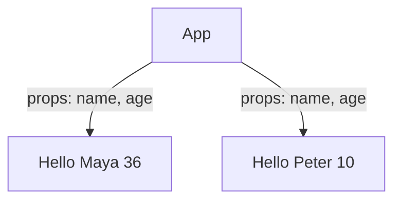
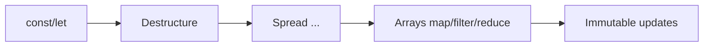
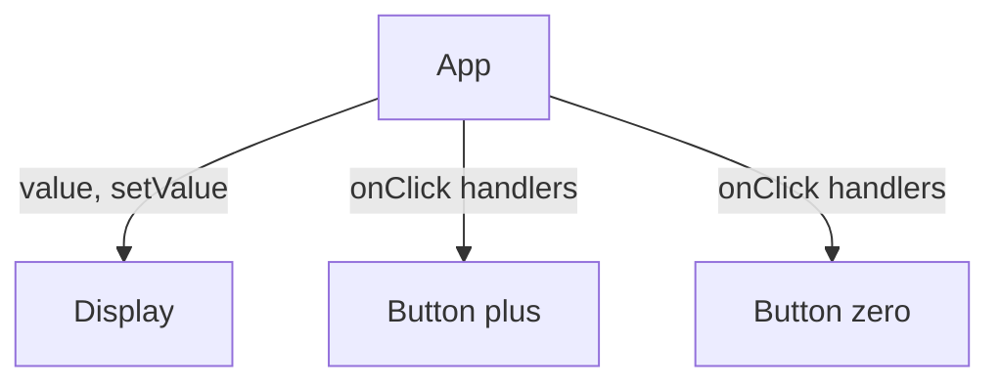
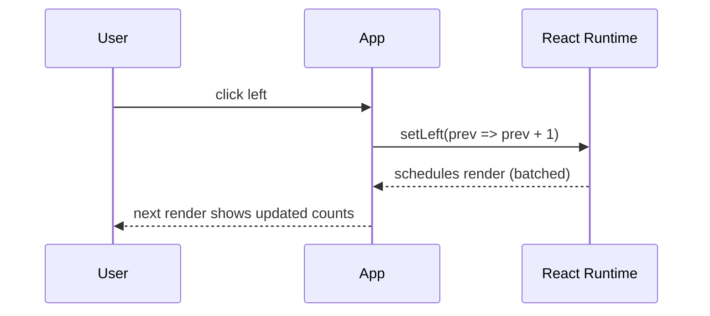
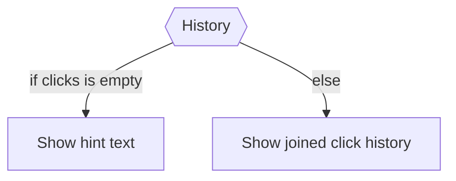
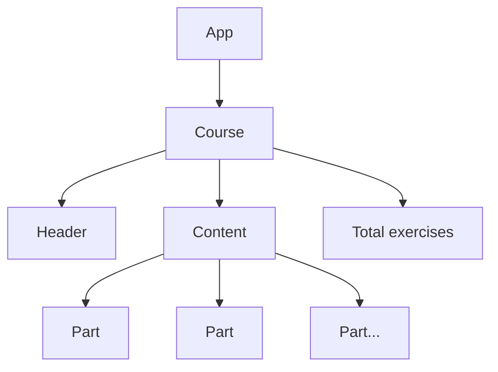
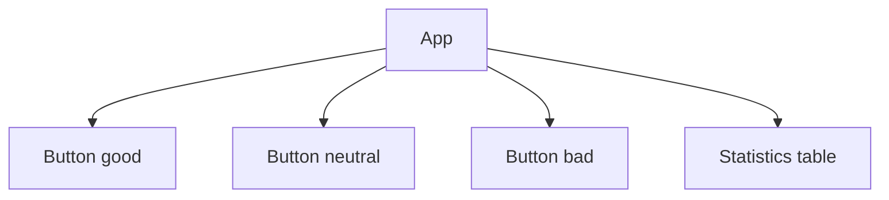
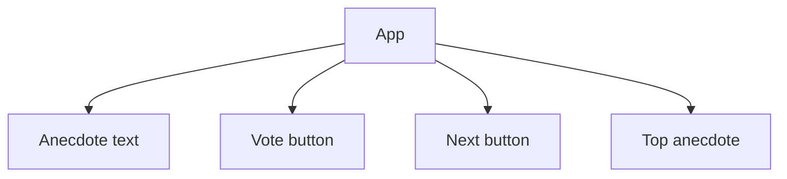

# Part 1 — Daily Study README (a → d)

Repository: **itsnothuy/FullStackOpen-Dairy**  
Course home: <https://fullstackopen.com/en/part1>

> This README summarizes what I studied across **Part 1a–1d**.  
> It’s written as proof-of-learning with runnable snippets, “why it matters,” and diagrams.

---

## How I worked (routine I follow each day)
- Keep **DevTools** open (Console + Elements). Verify behavior yourself.
- Take **3–6 TIL bullets** and a small **Mermaid** diagram.
- Commit immediately with `docs(part1): ...` messages.
- Start the next session with **retrieval practice**: answer yesterday’s self‑quiz from memory.

---

## Part 1a — Introduction to React

### Core ideas I proved
- **JSX** is JavaScript with XML‑ish markup; embed dynamic values with `{{ }}` in JSX.  
- **Components** are functions that return JSX; compose many small ones.  
- **Props** pass data **down**; use destructuring for clarity.  
- **Re‑render** happens when state/props change; otherwise React reuses DOM.

### Minimal examples
```jsx
// Hello.jsx
export default function Hello({ name, age }) {
  return (
    <div>
      <p>Hello {name}, you are {age} years old</p>
    </div>
  )
}

// App.jsx
import Hello from "./Hello"
export default function App() {
  return (
    <div>
      <h1>Greetings</h1>
      <Hello name="Maya" age={36} />
      <Hello name="Peter" age={10} />
    </div>
  )
}
```

### “Why this matters”
Small composable components + explicit data (props) make UIs predictable and testable.

### Diagram — component tree & data flow


---

## Part 1b — JavaScript essentials for React

### Concepts I drilled
- `let` (block‑scoped, reassign), `const` (block‑scoped, no reassignment), avoid `var` in modern code.
- **Objects/arrays are mutable in JS** → but in React state, **treat them as immutable** and return **new** copies.
- **Arrow functions**, **destructuring**, **spread** `...`, and **array methods** (`map`, `filter`, `reduce`).
- **Property access**: dot vs bracket; bracket enables dynamic keys.
- Handy utilities: `Array.concat`, `Array.join` for non‑mutating operations.

### Tiny cheatsheet
```js
// Destructuring + defaults
const person = { name: "Maya", age: 36 }
const { name, age = 0 } = person

// Array transforms (non-mutating)
const nums = [1, 2, 3]
const doubled = nums.map(n => n * 2)           // [2, 4, 6]
const odds = nums.filter(n => n % 2)           // [1, 3]
const sum = nums.reduce((s, n) => s + n, 0)    // 6

// Copies (immutability mindset)
const more = nums.concat(4)                    // [1,2,3,4]
const copy = [...nums, 5]                      // [1,2,3,5]
const updated = { ...person, age: 37 }         // new object
```

### Diagram — essential JS that shows up in React


---

## Part 1c — Component state & event handlers

### What I practiced
- `useState` gives a value + setter: `const [count, setCount] = useState(0)`.
- **Event handlers** are functions (not function calls) passed to `onClick`, `onSubmit`, etc.
- Breaking UI into small **Display** and **Button** components clarifies re‑renders.
- **Lifting state up**: parent owns data; children get data + handlers via props.

```jsx
// Button.jsx
export const Button = ({ onClick, children }) =>
  <button onClick={onClick}>{children}</button>

// App.jsx
import { useState } from "react"
import { Button } from "./Button"

export default function App() {
  const [counter, setCounter] = useState(0)
  const inc = () => setCounter(c => c + 1) // functional update
  const zero = () => setCounter(0)
  return (
    <div>
      <div>{counter}</div>
      <Button onClick={inc}>plus</Button>
      <Button onClick={zero}>zero</Button>
    </div>
  )
}
```

### Diagram — “lifting state up”


---

## Part 1d — A more complex state; debugging React apps (extended)

### What changed for me conceptually
- **State shape**: split into multiple `useState` *if* pieces change independently; use one object only when values are tightly coupled.
- **Arrays/objects in state**: never mutate; always create a new array/object (`concat`, spread, `map`, `filter`).
- **State updates are queued** → reads in the same handler can be stale. Use **functional updaters** or compute once, then set.
- **Conditional rendering**: early returns keep components readable.
- **Event‑handler patterns**: inline arrow, named handler, or **function that returns a function** (handler factory).
- **Passing handlers to children**: parent owns state; children call handlers via props.
- **Do not define components inside components**: keeps identity stable and avoids subtle bugs.
- **Debugging routine**: `console.log("..", obj)` (comma), `debugger`, **React DevTools** to inspect hook state in order.
- **Rules of Hooks**: call hooks at the top level of React functions only—never in loops/conditions or plain functions.

### Worked examples
```jsx
// Complex state: split vs combine
const [left, setLeft] = useState(0)
const [right, setRight] = useState(0)
// OR (tightly coupled)
const [clicks, setClicks] = useState({ left: 0, right: 0 })
const incLeft  = () => setClicks(s => ({ ...s, left: s.left + 1 }))

// Arrays in state
const [history, setHistory] = useState([])
const leftClick = () => setHistory(h => h.concat("L"))

// Async state: safe total
const leftSafe = () => {
  setLeft(l => l + 1)
  setTotal(t => t + 1) // or compute with updated local first
}

// Handler factory
const setTo = (v) => () => setValue(v)
<Button onClick={setTo(1000)}>thousand</Button>

// Pass handlers to children
const Button = ({ onClick, text }) => <button onClick={onClick}>{text}</button>

// Component boundaries (do this at module scope)
const Display = ({ value }) => <div>{value}</div>
```

### Diagrams — async flow & conditional render



### My debugging oath (applied daily)
- Keep **console open**; when stuck, **remove code** back to last known‑good.
- Log values with **commas**, not string concatenation.
- Use **React DevTools** to inspect tree and hook state order.
- Fix one issue at a time; make tiny commits.

---

## “Proof” stash for the 3 apps (notes templates)

These are the short component‑tree diagrams I keep under `notes/` (one per app).







---

## Self‑quiz across Part 1 (for tomorrow’s retrieval)
1. Show two cases where **split** state beats a single object, and one where a single object is justified.  
2. Update an **array of objects** in state without mutation (toggle a boolean).  
3. Why can `setTotal(left + right)` be wrong after `setLeft(left + 1)`? Fix it two ways.  
4. Convert an inline handler to a **curried** handler factory. When is it clearer?  
5. Why not define components **inside** components? What breaks?  
6. What does **React DevTools** reveal about hook ordering?  
7. Write a minimal **conditional render** with an early return.

---

## Commit suggestions
```bash
docs(part1): add top-level study README (a–d) with diagrams and examples
chore(notes): add component-tree Mermaid files for courseinfo/unicafe/anecdotes
```

## References (quick links for future me)
- **Full Stack Open, Part 1 overview & pages**  
  1a: <https://fullstackopen.com/en/part1/introduction_to_react>  
  1b: <https://fullstackopen.com/en/part1/java_script>  
  1c: <https://fullstackopen.com/en/part1/component_state_event_handlers>  
  1d: <https://fullstackopen.com/en/part1/a_more_complex_state_debugging_react_apps>

- **React docs (react.dev)**  
  State as component memory: <https://react.dev/learn/state-a-components-memory>  
  Responding to events: <https://react.dev/learn/responding-to-events>  
  Sharing state between components: <https://react.dev/learn/sharing-state-between-components>  
  Conditional rendering: <https://react.dev/learn/conditional-rendering>  
  Choosing state structure: <https://react.dev/learn/choosing-the-state-structure>  
  Queueing a series of state updates: <https://react.dev/learn/queueing-a-series-of-state-updates>  
  Updating **objects/arrays** in state: <https://react.dev/learn/updating-objects-in-state>, <https://react.dev/learn/updating-arrays-in-state>  
  React DevTools: <https://react.dev/learn/react-developer-tools>

- **MDN**  
  `let` / `const` / `var`: <https://developer.mozilla.org/en-US/docs/Web/JavaScript/Reference/Statements/let>, <https://developer.mozilla.org/en-US/docs/Web/JavaScript/Reference/Statements/const>, <https://developer.mozilla.org/en-US/docs/Web/JavaScript/Reference/Statements/var>  
  Arrays: `concat`, `map`, `forEach`, `join`: <https://developer.mozilla.org/en-US/docs/Web/JavaScript/Reference/Global_Objects/Array/concat>, <https://developer.mozilla.org/en-US/docs/Web/JavaScript/Reference/Global_Objects/Array/map>, <https://developer.mozilla.org/en-US/docs/Web/JavaScript/Reference/Global_Objects/Array/forEach>, <https://developer.mozilla.org/en-US/docs/Web/JavaScript/Reference/Global_Objects/Array/join>  
  Destructuring & property accessors: <https://developer.mozilla.org/en-US/docs/Web/JavaScript/Reference/Operators/Destructuring>, <https://developer.mozilla.org/en-US/docs/Web/JavaScript/Reference/Operators/Property_accessors>  
  Debugging utilities: `setTimeout`, `debugger`: <https://developer.mozilla.org/en-US/docs/Web/API/Window/setTimeout>, <https://developer.mozilla.org/en-US/docs/Web/JavaScript/Reference/Statements/debugger>

- **Oath reference** (F.S.O. reminder in Part 2): <https://fullstackopen.com/en/part2/rendering_a_collection_modules#web-developer-s-oath>

---

_Authored on 2025-10-01._
