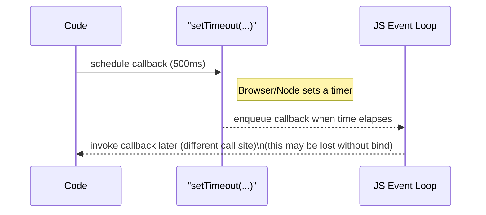

# Day Study Log — Part 1b: JavaScript — 2025-10-01

Repository: **itsnothuy/FullStackOpen-Dairy**  
Course: [Full Stack Open](https://fullstackopen.com/en/) → Part 1b: [JavaScript](https://fullstackopen.com/en/part1/java_script)

---

## What I accomplished today
- ✅ Read **Part 1b: JavaScript** end-to-end and aligned my notes with the official material.
- ✅ Practiced in **Node REPL** and **DevTools Console** (variables, arrays, objects, functions).
- ✅ Verified **immutability-friendly patterns** for React (prefer `concat`, spreads, `map`, etc., rather than mutating arrays in place).
- ✅ Explored **functions** (declaration vs expression vs **arrow**), and how **`this`** behaves.
- ✅ Reproduced the **`this` + `bind` + `setTimeout`** examples and wrote a Mermaid diagram of the async flow.
- ✅ Captured a TIL + self‑quiz for retrieval practice.

_Support & proofs for the items above are in the sections below._

---

## Repro steps (so anyone can verify what I did)

### 1) Variables — `let`, `const`, `var`
```js
// Node REPL or DevTools console
let y = 5; const x = 1;
console.log(x, y); // 1 5
y += 10;           // OK
// x = 4;          // ❌ TypeError: Assignment to constant variable.

// const with objects/arrays: reference is frozen, contents are not
const arr = [1, -1, 3];
arr.push(5);               // ✅ allowed (mutates array)
console.log(arr.length);   // 4
// arr = [99];             // ❌ cannot reassign reference
```
Notes:
- `let` = block-scoped, reassignable. `const` = block-scoped, **not** reassignable (but object **contents** can change). `var` = function/global-scoped; avoid in modern React code.  

### 2) Arrays — `forEach`, `map`, **immutability**
```js
const t = [1, 2, 3];

t.forEach((value, idx) => console.log(idx, value)); // side-effects only

const doubled = t.map(v => v * 2); // returns new array, non-mutating
console.log(doubled);              // [2, 4, 6]

// Prefer non-mutating ops in React state updates
const t2 = t.concat(5);       // returns new array (does not change t)
console.log(t);  // [1, 2, 3]
console.log(t2); // [1, 2, 3, 5]
```

### 3) Destructuring (arrays & objects)
```js
const nums = [1, 2, 3, 4, 5];
const [first, second, ...rest] = nums;
console.log(first, second); // 1 2
console.log(rest);          // [3,4,5]

const person = { name: "Arto Hellas", age: 35 };
const { name, age } = person;
console.log(name, age);
```

### 4) Objects — dot vs bracket notation; dynamic keys
```js
const object1 = { name: "Arto Hellas", age: 35 };
console.log(object1.name);        // dot
const field = "age";
console.log(object1[field]);      // bracket (dynamic)

object1.address = "Helsinki";     // add new prop
object1["secret number"] = 12341; // bracket form required due to space
```

### 5) Functions — declaration, expression, arrow
```js
// declaration (hoisted to top of scope)
function product(a, b) { return a * b; }

// expression
const average = function(a, b) { return (a + b) / 2; };

// arrow: concise and ideal in array callbacks / React props
const square = (n) => n * n;

console.log(product(2,6), average(2,5), square(5));
```

### 6) `this` + `bind` + `setTimeout`
```js
const arto = {
  name: "Arto Hellas",
  greet: function() { console.log("hello, my name is " + this.name); },
  doAddition: function(a, b){ console.log(a + b); }
};

arto.greet();                 // "hello, my name is Arto Hellas"

const refGreet = arto.greet;  // ❌ loses this
// refGreet();                // "hello, my name is undefined"

const bound = arto.greet.bind(arto); // ✅ fix this
bound();                      // "hello, my name is Arto Hellas"

setTimeout(arto.greet, 500);         // ❌ loses this when called later
setTimeout(arto.greet.bind(arto), 500); // ✅ prints correct name
```

### 7) (Optional) Class syntax — for context
```js
class Person {
  constructor(name, age) { this.name = name; this.age = age; }
  greet() { console.log(`hello, my name is ${name}`); }
}
new Person("Adam", 29).greet();
```

---

## Mermaid evidence (async `setTimeout` → callback)


---

## Today’s TIL (highlights)
- `const` prevents **reassignment** of the variable identifier, not mutation of an object/array it references.  
- Prefer **non-mutating** array operations in React state flows: `map`, `concat`, spreads, etc.  
- **Destructuring** cleanly unpacks arrays/objects into variables.  
- **Arrow functions** are concise and great for callbacks; remember they don’t have their own `this`.  
- `this` depends on **call-site**; use **`bind`** (or arrow callbacks capturing lexical `this`) to control it, e.g., with `setTimeout`.

---

## Self‑quiz (answer from memory tomorrow)
1) Why is `arr.push(5)` allowed when `arr` was declared with `const`?  
2) When updating React state, why is `concat` preferable to `push`?  
3) Show array and object **destructuring** examples.  
4) What’s the difference between a **function declaration** and a **function expression**?  
5) Why does `setTimeout(arto.greet, 500)` lose `this`, and how does `bind` fix it?  

---

## Commit suggestions
```bash
docs(part1): add detailed Part 1b (JavaScript) day log + async diagram
docs(notes): TIL + self-quiz on JS basics (let/const/var, map/concat, this/bind)
```

---

## References (for repo readers)
- FSO — Part 1b: **JavaScript** (official)  
  https://fullstackopen.com/en/part1/java_script
- MDN — **let**, **const**, **var**  
  https://developer.mozilla.org/en-US/docs/Web/JavaScript/Reference/Statements/let  
  https://developer.mozilla.org/en-US/docs/Web/JavaScript/Reference/Statements/const  
  https://developer.mozilla.org/en-US/docs/Web/JavaScript/Reference/Statements/var
- MDN — Arrays: **forEach**, **map**, **concat**  
  https://developer.mozilla.org/en-US/docs/Web/JavaScript/Reference/Global_Objects/Array/forEach  
  https://developer.mozilla.org/en-US/docs/Web/JavaScript/Reference/Global_Objects/Array/map  
  https://developer.mozilla.org/en-US/docs/Web/JavaScript/Reference/Global_Objects/Array/concat
- MDN — **Destructuring**  
  https://developer.mozilla.org/en-US/docs/Web/JavaScript/Reference/Operators/Destructuring
- MDN — **Property accessors** (dot vs bracket)  
  https://developer.mozilla.org/en-US/docs/Web/JavaScript/Reference/Operators/Property_accessors
- MDN — **Arrow functions**, **Functions**  
  https://developer.mozilla.org/en-US/docs/Web/JavaScript/Reference/Functions/Arrow_functions  
  https://developer.mozilla.org/en-US/docs/Web/JavaScript/Guide/Functions
- MDN — **this**, **bind**, **setTimeout**, **Classes**  
  https://developer.mozilla.org/en-US/docs/Web/JavaScript/Reference/Operators/this  
  https://developer.mozilla.org/en-US/docs/Web/JavaScript/Reference/Global_Objects/Function/bind  
  https://developer.mozilla.org/en-US/docs/Web/API/Window/setTimeout  
  https://developer.mozilla.org/en-US/docs/Web/JavaScript/Reference/Classes
