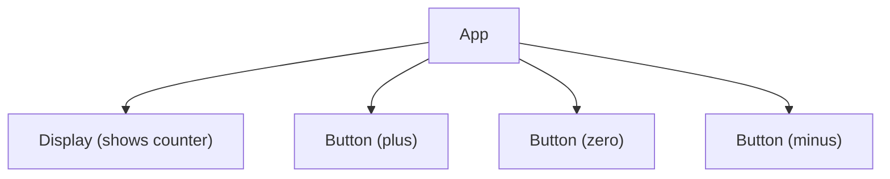
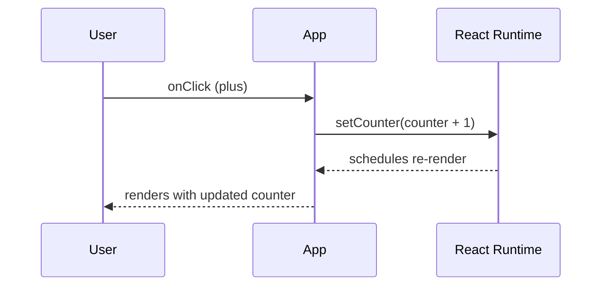
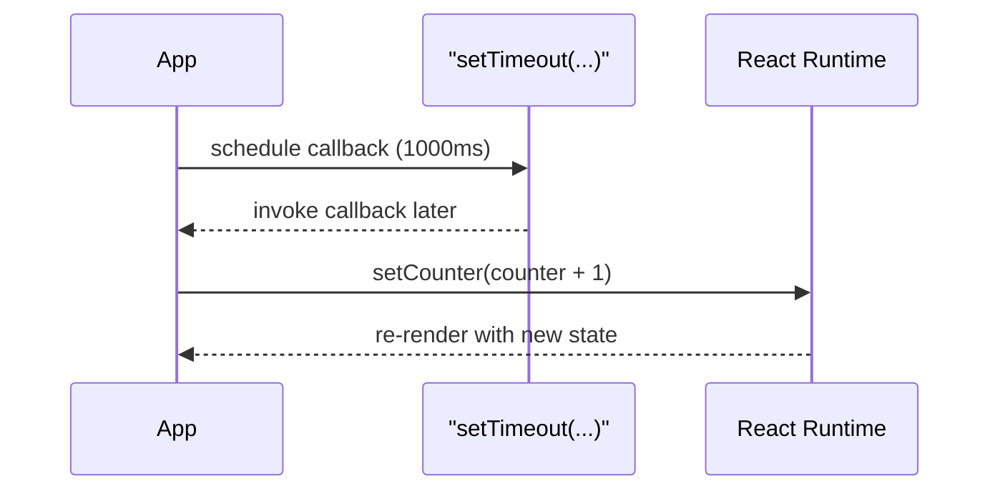

# Day Study Log — Part 1c: Component state, event handlers — 2025-10-01

Repository: **itsnothuy/FullStackOpen-Dairy**  
Course: [Full Stack Open](https://fullstackopen.com/en/) → Part 1c: [Component state, event handlers](https://fullstackopen.com/en/part1/component_state_event_handlers)

---

## What I accomplished today
- ✅ Read **Part 1c** and aligned my practice with the official examples (counter, event handlers, component extraction).  
- ✅ Implemented a **counter** using `useState`, first with `setTimeout` auto-increment, then with **buttons** wired via `onClick`.  
- ✅ Separated **Display** and **Button** into their own components; passed state and handlers via **props** (lifting state up is kept in the parent).  
- ✅ Practiced **logging renders** to understand when/why React re-renders after `setState`.  
- ✅ Captured Mermaid **proof diagrams** for component tree and the click → state update → re-render flow, plus a self‑quiz.

_These align with React’s docs on state, events, and lifting state._

---

## Repro steps (so anyone can verify what I did)

> You can use the `part1/unicafe` scaffold or make a quick temp app. Below assumes a fresh Vite app:

```bash
npm create vite@latest part1c-demo -- --template react
cd part1c-demo
npm install
npm run dev
```

### 1) Minimal counter with auto‑increment (App.jsx)
```jsx
import { useState } from 'react'

const App = () => {
  const [counter, setCounter] = useState(0)

  // demo: increment once after 1s (render -> schedule -> later invoke)
  setTimeout(() => setCounter(counter + 1), 1000)

  console.log('rendering with counter =', counter)

  return (
    <div style={{ fontFamily: 'system-ui, sans-serif' }}>
      <h1>Counter</h1>
      <div>{counter}</div>
    </div>
  )
}

export default App
```

### 2) Add buttons and proper event handlers
```jsx
import { useState } from 'react'

const App = () => {
  const [counter, setCounter] = useState(0)

  const increaseByOne = () => setCounter(counter + 1)
  const decreaseByOne = () => setCounter(counter - 1)
  const setToZero     = () => setCounter(0)

  return (
    <div style={{ fontFamily: 'system-ui, sans-serif', lineHeight: 1.5 }}>
      <h1>Counter</h1>
      <div>{counter}</div>

      {/* handlers must be functions, not function calls */}
      <button onClick={increaseByOne}>plus</button>
      <button onClick={setToZero}>zero</button>
      <button onClick={decreaseByOne}>minus</button>
    </div>
  )
}

export default App
```

### 3) Extract `Display` and `Button` components
```jsx
import { useState } from 'react'

const Display = ({ counter }) => <div>{counter}</div>

const Button = ({ onClick, text }) => (
  <button onClick={onClick}>{text}</button>
)

const App = () => {
  const [counter, setCounter] = useState(0)

  const increaseByOne = () => setCounter(counter + 1)
  const decreaseByOne = () => setCounter(counter - 1)
  const setToZero     = () => setCounter(0)

  return (
    <div style={{ fontFamily: 'system-ui, sans-serif', lineHeight: 1.5 }}>
      <h1>Counter</h1>
      <Display counter={counter} />
      <Button onClick={increaseByOne} text="plus" />
      <Button onClick={setToZero} text="zero" />
      <Button onClick={decreaseByOne} text="minus" />
    </div>
  )
}

export default App
```

> Notes:
> - **Event handler must be a function** (e.g., `onClick={() => setCounter(counter + 1)}`), not a function **call** like `onClick={setCounter(counter + 1)}`.  
> - **State lives in the parent** (App) and is passed to children as props; this is “lifting state up”.

---

## Mermaid evidence

### A) Component tree


### B) Click → setState → re‑render


### C) Async scheduling example


---

## Today’s TIL (highlights)
- `useState` returns a **pair**: current state + setter. Calling the setter schedules a **re-render** with the next state.  
- **Event handlers** in JSX are **functions** you pass to props like `onClick`; React calls them in response to user interactions (mouse, touch, keyboard).  
- State should live in the **closest common parent** when multiple children need it (**lift state up**), then pass it down via props.  
- Logging inside components shows **when** they render; it’s a simple way to understand render timing.  
- `setTimeout` schedules code for later; when the callback calls the state setter, the component re-renders with the new value.

---

## Self‑quiz (answer tomorrow from memory)
1) Why does `onClick={setCounter(counter + 1)}` cause an immediate loop, and how do you fix it?  
2) What does `useState` return, and how does React decide which state variable corresponds to which call?  
3) In the Display/Button extraction, where does the state live and why?  
4) How can you _prove_ that clicking a button triggers a re-render?  
5) What’s the difference between `setTimeout` and directly calling the setter in an event handler?

---

## Commit suggestions
```bash
docs(part1): add detailed Part 1c day log (state + events) with diagrams
refactor(counter): extract Display and Button components
```
(Optional if you keep the demo app separate:)
```bash
chore(part1): scaffold part1c-demo (Vite + React)
```

---

## References (for repo readers)
- **Full Stack Open — Part 1c: Component state, event handlers** (official examples and guidance).  
  https://fullstackopen.com/en/part1/component_state_event_handlers
- **React docs — State: A Component’s Memory** (what state is and how re-renders work).  
  https://react.dev/learn/state-a-components-memory
- **React docs — Responding to Events** (how to declare/attach event handlers).  
  https://react.dev/learn/responding-to-events
- **React docs — Sharing State Between Components** (lifting state up).  
  https://react.dev/learn/sharing-state-between-components
- **React reference — useState** (API specifics).  
  https://react.dev/reference/react/useState
- **MDN — click event** (what counts as a click: mouse, touch, keyboard).  
  https://developer.mozilla.org/en-US/docs/Web/API/Element/click_event
- **MDN — setTimeout / setInterval** (scheduling callbacks).  
  https://developer.mozilla.org/en-US/docs/Web/API/Window/setTimeout  
  https://developer.mozilla.org/en-US/docs/Web/API/Window/setInterval

- **Proof of study:** My annotated PDF: _Fullstack part1 — Component state, event handlers_ (attached in this repo).
