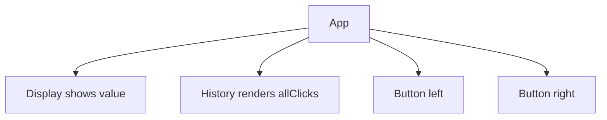
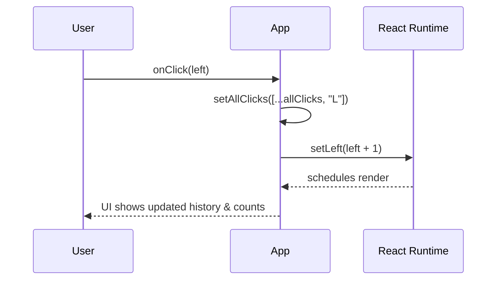
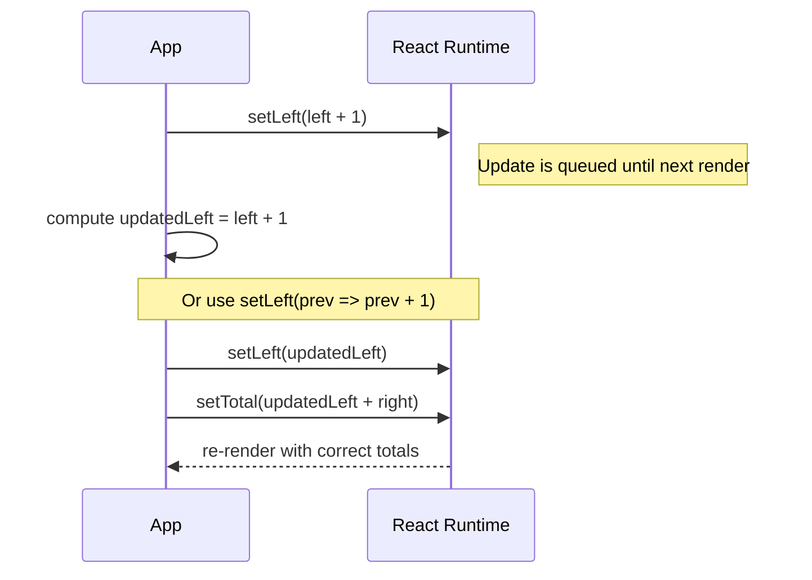

# Day Study Log — Part 1d (Extended): A more complex state, debugging React apps — 2025-10-01

Repository: **itsnothuy/FullStackOpen-Dairy**  
Course: [Full Stack Open → Part 1d](https://fullstackopen.com/en/part1/a_more_complex_state_debugging_react_apps)

---

## Why this part felt “dense”
Part 1d packs a lot of *React mental models* into one sitting: state shape, immutable updates, async scheduling, conditional branches, handler patterns, component boundaries, and debugging hygiene. This extended log gives each idea its own space **with concrete code, pitfalls, and “why” explanations**, so you can point to it as proof-of-study.

---

## 1) Complex state — when to split vs. combine
**TL;DR:** Prefer *multiple* `useState` hooks for independent pieces. Use a *single object* only when values are tightly coupled (you always read/write them together).

```jsx
// A: split state (simpler)
const [left, setLeft] = useState(0)
const [right, setRight] = useState(0)

// B: combined object (only if tightly coupled)
const [clicks, setClicks] = useState({ left: 0, right: 0 })
const incLeft  = () => setClicks({ ...clicks, left: clicks.left + 1 })
const incRight = () => setClicks({ ...clicks, right: clicks.right + 1 })
```

**Why this matters:** smaller, focused state is easier to reason about and less error‑prone. If you *must* combine, always copy with spread and replace the object; never mutate `{...}` in place.

**Heuristics for picking state shape:**
- Will these values ever be updated separately? → **Split**.
- Do I derive one value from others? → Compute it on render, don’t store it.
- Would an object cause deep updates that get messy? → **Split** or introduce a reducer later.

---

## 2) Handling arrays — *immutably*, every time
**Goal:** track click history (`["L", "R", "L"]`) without mutating state.

```jsx
const [allClicks, setAllClicks] = useState([])

// ✅ non-mutating
setAllClicks(allClicks.concat("L"))
// or
setAllClicks([...allClicks, "L"])

// ❌ mutating (don’t do this)
allClicks.push("L")
setAllClicks(allClicks)
```

Common operations you’ll use later:
```jsx
// remove by index
setTodos(todos.filter((_, i) => i !== idx))

// update item
setTodos(todos.map(t => t.id === id ? { ...t, done: !t.done } : t))

// insert at index
setItems([...items.slice(0, i), newItem, ...items.slice(i)])
```

> For nested structures, prefer mapping/spreading. (Later you’ll meet helpers like **Immer**.)

---

## 3) State updates are **asynchronous** (batched) — avoid “off‑by‑one”
When you call a setter, React **queues** the update and applies it on the next render. Two safe patterns:

```jsx
// A: compute first, then use
const onLeft = () => {
  const updatedLeft = left + 1
  setLeft(updatedLeft)
  setTotal(updatedLeft + right)
}

// B: functional updater (recommended when next state depends on previous)
setLeft(prev => prev + 1)
setTotal(prev => prev + 1) // only correct if you mean +1 independently
```

**When to prefer the functional form:** any time you derive the next value *from the previous*. It protects you from stale closures and multiple rapid updates.

---

## 4) Conditional rendering — just JS
Use `if`, `&&`, or the `?:` operator to render different JSX.

```jsx
const History = ({ allClicks }) => {
  if (allClicks.length === 0) {
    return <div>the app is used by pressing the buttons</div>
  }
  return <div>button press history: {allClicks.join(" ")}</div>
}
```

Micro‑tips:  
- Short, focused components make conditionals easier to see.  
- Prefer **early returns** for “empty” states to reduce nesting.

---

## 5) “Old React” context — what changed and why it matters
Before Hooks (≤ React 16.7), *stateful* components were **classes**. They used `this.state` and `this.setState()`, and handlers usually needed `this` binding. You’ll still encounter legacy code:

```jsx
import React, { Component } from "react"
class Counter extends Component {
  state = { count: 0 }
  handleClick = () => this.setState({ count: this.state.count + 1 }) // auto-bound arrow
  render() {
    return <button onClick={this.handleClick}>{this.state.count}</button>
  }
}
```

Today, prefer **function components + Hooks**. Knowing this history helps you read older tutorials and repos without confusion.

---

## 6) Debugging React apps — a workable routine
- **Keep DevTools open**. In Console, prefer commas:  
  `console.log("props value is", props)` instead of string concatenation.
- Drop a `debugger` statement where things go wrong, then step through.
- Install **React DevTools** to inspect component trees, props, and **Hook state in order of declaration**. This makes “why did it re‑render?” questions concrete.
- Common gotchas you’ll actually hit:
  - *“Objects are not valid as a React child”* → You rendered an object; render a string/number or map over arrays.
  - Infinite re-render → You passed a **function call** instead of a **function** to an event prop, or you mutate state and set it back.
  - Stale values in logs → Remember setters are async; log after render or use the functional form.

---

## 7) Rules of Hooks — the “why”, not just the rule
> **Only call hooks at the top level of component functions (or custom hooks).**  
Why: React relies on the **order** of hook calls to associate state with them. If you call hooks in loops/conditions, the order can change across renders and state gets confused.

**OK**
```jsx
function App() {
  const [age, setAge] = useState(0)
  const [name, setName] = useState("Juha")
  // early return AFTER hooks is fine
  if (age < 0) return null
  // ...
}
```

**Not OK**
```jsx
function App() {
  if (someFlag) {
    const [x, setX] = useState(0) // ❌ inside conditional
  }
  // ...
}
```

---

## 8) Event handling revisited — the common mistakes
- Event props expect a **function**, not a **function call**.
- To pass arguments, wrap in an arrow: `onClick={() => doThing(id)}`.
- Handlers can be defined inline or named; pick readability.
- React uses **camelCase** events (`onClick`, `onSubmit`) and **synthetic events**; use `event.preventDefault()` instead of `return false` in forms.

```jsx
<button onClick={() => setValue(0)}>reset</button>     // ✅
<button onClick={setValue(0)}>reset</button>           // ❌ executes immediately
```

---

## 9) A function that returns a function — the handler “factory”
This is just **currying** a handler so you can pre‑configure data:

```jsx
const setToValue = (newValue) => () => {
  console.log("value now", newValue)
  setValue(newValue)
}

<button onClick={setToValue(1000)}>thousand</button>
<button onClick={setToValue(0)}>reset</button>
<button onClick={setToValue(value + 1)}>increment</button>
```

When to use:
- You need the **same logic** with different parameters.
- You want clearer JSX than `onClick={() => setToValue(1000)}` in some cases.

---

## 10) Passing event handlers to child components
Lift state up to the parent, pass **data and handlers via props**:
```jsx
const Button = ({ onClick, text }) => <button onClick={onClick}>{text}</button>

// Parent
<Button onClick={() => setToValue(1000)} text="thousand" />
<Button onClick={() => setToValue(0)} text="reset" />
<Button onClick={() => setToValue(value + 1)} text="increment" />
```

Naming tip: in parent code prefer `handleSomething` for functions you pass down, and `onSomething` for props your child accepts.

---

## 11) Do **not** define components within components
Defining a child component **inside** the parent’s render function gives it a **new identity each render**. That breaks React’s ability to preserve state and optimize.

```jsx
// ❌ don’t do this
const App = () => {
  const Display = ({ value }) => <div>{value}</div> // redefined every render
  // ...
}

// ✅ define at module top level
const Display = ({ value }) => <div>{value}</div>
const App = () => {/* ... */}
```

---

## 12) Useful reading (for future me)
- Choosing state structure, updating objects/arrays, and queued updates in modern docs.
- Conditional rendering patterns.
- React DevTools guide (install + inspect + profile).

---

## 13) Web programmer’s oath (my commitments)
- Keep the **browser console** open.
- Progress in **small steps**.
- Log a lot (`console.log`) to understand behavior and pinpoint bugs.
- When stuck, **don’t add more code**; **delete** down to last working state.
- Ask good questions (include repro steps, error text, expected vs actual).

---

## 14) Using Large Language Models (LLMs) responsibly
**Do:** ask for explanations, error triage, vocabulary, or hints; generate small helpers you can read and verify.  
**Don’t:** outsource whole features or exercises; don’t trust output blindly. Watch for **hallucinations**, **security issues**, and **code repetition**. You’re the **pilot**—AI is the copilot.

---

## Mermaid “proof” diagrams

### A) Component tree for the click app


### B) Click → immutable update → re-render


### C) Async state gotcha → two safe fixes
```mermaid
sequenceDiagram
  participant App
  participant React as React Runtime

  App->>React: setLeft(left + 1)  %% enqueued
  Note right of React: Update is queued until next render

  App-->>App: const updatedLeft = left + 1  %% or setLeft(prev => prev + 1)
  App->>React: setLeft(updatedLeft); setTotal(updatedLeft + right)
  React-->>App: re-render with correct totals
```


*(Note: labels avoid parentheses to render cleanly on GitHub.)*

---

## Self‑quiz (answer from memory tomorrow)
1) Give two concrete examples where **split** state is better than a single object, and one where a single object is justified.  
2) Show how to **toggle** an item in an **array of objects** in state without mutation.  
3) Explain why `setTotal(left + right)` can be wrong after `setLeft(left + 1)`. Fix it two ways.  
4) Convert an inline handler to a **currying** handler factory. When is it clearer?  
5) Why does defining a component inside a component cause bugs? What breaks?  
6) Which Hook rules would your lint rule catch in this file? Why do they exist?  
7) How would you use **React DevTools** to confirm which component re-renders on a click?

---

## Commit suggestions
```bash
docs(part1): add extended Part 1d study log (complex state, arrays, async, conditionals, handlers, debugging)
chore(notes): add mermaid diagrams for component tree and async state flow
```

---

## References (for repo readers)
- **Full Stack Open — Part 1d** (examples: split vs combined state, arrays, async, conditional, handler patterns, component boundaries, oath, LLMs).  
  https://fullstackopen.com/en/part1/a_more_complex_state_debugging_react_apps
- **React docs (react.dev)**: Choosing the State Structure; Queueing a Series of State Updates; Updating Objects/Arrays in State; Conditional Rendering; Rules of Hooks; React DevTools.  
  https://react.dev/learn/choosing-the-state-structure  
  https://react.dev/learn/queueing-a-series-of-state-updates  
  https://react.dev/learn/updating-objects-in-state  
  https://react.dev/learn/updating-arrays-in-state  
  https://react.dev/learn/conditional-rendering  
  https://react.dev/reference/rules/rules-of-hooks  
  https://react.dev/learn/react-developer-tools
- **MDN**: Spread syntax; Array concat/push/join; `setTimeout`; `debugger`.  
  https://developer.mozilla.org/en-US/docs/Web/JavaScript/Reference/Operators/Spread_syntax  
  https://developer.mozilla.org/en-US/docs/Web/JavaScript/Reference/Global_Objects/Array/concat  
  https://developer.mozilla.org/en-US/docs/Web/JavaScript/Reference/Global_Objects/Array/push  
  https://developer.mozilla.org/en-US/docs/Web/JavaScript/Reference/Global_Objects/Array/join  
  https://developer.mozilla.org/en-US/docs/Web/API/Window/setTimeout  
  https://developer.mozilla.org/en-US/docs/Web/JavaScript/Reference/Statements/debugger
- **Legacy context** for old React knowledge: Class components, `setState`, event handling.  
  https://legacy.reactjs.org/docs/state-and-lifecycle.html  
  https://legacy.reactjs.org/docs/handling-events.html
