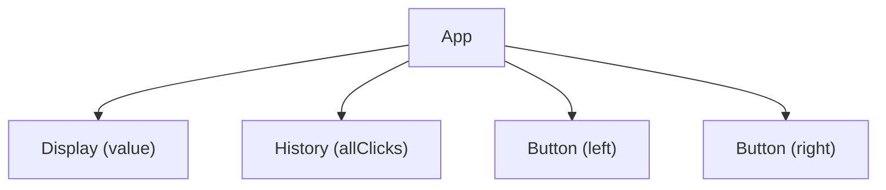
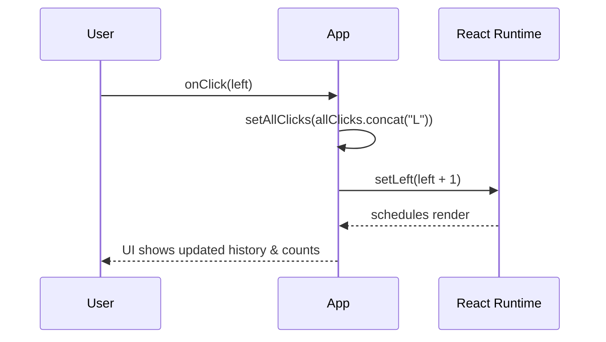

# Day Study Log — Part 1d: A more complex state, debugging React apps — 2025-10-01

Repository: **itsnothuy/FullStackOpen-Dairy**  
Course: [Full Stack Open → Part 1d](https://fullstackopen.com/en/part1/a_more_complex_state_debugging_react_apps)

---

## What I accomplished today
- ✅ Read **Part 1d** and replicated all key examples (split vs combined state, arrays in state, async updates, conditional rendering, handler patterns, component boundaries).  
- ✅ Practiced **two approaches** to state: multiple `useState` vs a single object + object spread.  
- ✅ Tracked click **history** in an array using **non‑mutating** updates.  
- ✅ Proved **async state** behavior and fixed off‑by‑one with an intermediate variable.  
- ✅ Revisited **event handlers** (must be functions), **function‑returns‑function** pattern, and passing handlers to children.  
- ✅ Used **console logs**, **`debugger`**, and **React DevTools** to inspect state and renders.

---

## Repro steps (so anyone can verify what I did)

> You can do this within any Vite + React scaffold (e.g., `part1/unicafe`) or a fresh temp app.

```bash
npm create vite@latest part1d-demo -- --template react
cd part1d-demo
npm install
npm run dev
```

### 1) Separate pieces of state (left/right counters)
```jsx
import { useState } from 'react'

export default function App() {
  const [left, setLeft] = useState(0)
  const [right, setRight] = useState(0)

  return (
    <div style={{ fontFamily: 'system-ui, sans-serif', lineHeight: 1.5 }}>
      <h1>Clicks</h1>
      <div>left {left}</div>
      <div style={{ display: 'flex', gap: 8 }}>
        <button onClick={() => setLeft(left + 1)}>left</button>
        <button onClick={() => setRight(right + 1)}>right</button>
      </div>
      <div>right {right}</div>
    </div>
  )
}
```

**Why this matters:** keeping state *minimal and focused* is often simpler than one big object. See “Choosing the State Structure”.

### 2) Single object state + object spread
```jsx
import { useState } from 'react'

export default function App() {
  const [clicks, setClicks] = useState({ left: 0, right: 0 })

  const incLeft  = () => setClicks({ ...clicks, left:  clicks.left  + 1 })
  const incRight = () => setClicks({ ...clicks, right: clicks.right + 1 })

  return (
    <div style={{ fontFamily: 'system-ui, sans-serif', lineHeight: 1.5 }}>
      <h1>Clicks (object state)</h1>
      <div>left {clicks.left}</div>
      <div style={{ display: 'flex', gap: 8 }}>
        <button onClick={incLeft}>left</button>
        <button onClick={incRight}>right</button>
      </div>
      <div>right {clicks.right}</div>
    </div>
  )
}
```

Notes:
- Use **object spread** to create a *new* object; don’t mutate the existing state object.
- If there’s no benefit to combining, prefer **separate pieces of state** for clarity.

### 3) Array state for click history (immutably)
```jsx
import { useState } from 'react'

export default function App() {
  const [left, setLeft] = useState(0)
  const [right, setRight] = useState(0)
  const [allClicks, setAllClicks] = useState([]) // history: e.g. ["L","R","L"]

  const onLeft  = () => { setAllClicks(allClicks.concat('L')); setLeft(left + 1) }
  const onRight = () => { setAllClicks(allClicks.concat('R')); setRight(right + 1) }

  return (
    <div style={{ fontFamily: 'system-ui, sans-serif', lineHeight: 1.5 }}>
      <h1>History</h1>
      <div style={{ display: 'flex', gap: 8 }}>
        <button onClick={onLeft}>left</button>
        <button onClick={onRight}>right</button>
      </div>
      <p>{allClicks.join(' ')}</p>
    </div>
  )
}
```
- **`concat`** returns a new array; **`push`** mutates. For React state, prefer non‑mutating updates.  
- **`join(' ')`** produces a space‑separated string for proof in the UI.

### 4) Async state & off‑by‑one (and fix)
```jsx
const onLeft = () => {
  // ❌ buggy: setLeft is async; left is still the "old" value in this call
  // setLeft(left + 1)
  // setTotal(left + right) // off by one

  // ✅ fix: compute first, then use
  const updatedLeft = left + 1
  setLeft(updatedLeft)
  setTotal(updatedLeft + right)
}
```
- State updates are **queued**; React applies them on the next render. Use an intermediate value (or an updater function) to avoid off‑by‑one.

### 5) Conditional rendering (`History` component)
```jsx
function History({ allClicks }) {
  if (allClicks.length === 0) {
    return <div>the app is used by pressing the buttons</div>
  }
  return <div>button press history: {allClicks.join(' ')}</div>
}
```
- Return **different JSX** based on conditions; short‑circuit or ternary works too.

### 6) Event handling patterns (must be a function)
```jsx
<button onClick={() => setValue(0)}>reset</button>     // ✅ a function
<button onClick={setValue(0)}>reset</button>          // ❌ calls immediately, loops

// Extracted handler
const handleClick = () => setValue(0)
<button onClick={handleClick}>reset</button>

// Function returning function (factory)
const setToValue = (newValue) => () => { console.log('value now', newValue); setValue(newValue) }
<button onClick={setToValue(1000)}>thousand</button>
<button onClick={setToValue(0)}>reset</button>
<button onClick={setToValue(value + 1)}>increment</button>
```

### 7) Passing handlers to children + component boundaries
```jsx
const Button = ({ onClick, text }) => <button onClick={onClick}>{text}</button>
const Display = ({ value }) => <div>{value}</div>

// ❌ Don’t define components *inside* another component body
// ✅ Define them at module top level (outside App)
```

---

## Mermaid evidence

### A) Component tree (click app with history)


### B) Click → immutable update → re‑render


### C) Async update gotcha (fix with intermediate value)
```mermaid
sequenceDiagram
  participant App
  participant Timer as "setTimeout(...)"
  participant React as React Runtime

  App->>Timer: schedule callback
  Timer-->>App: invoke callback later
  App->>App: const updatedLeft = left + 1
  App->>React: setLeft(updatedLeft); setTotal(updatedLeft + right)
  React-->>App: re-render with correct totals
```

---

## Today’s TIL (highlights)
- Prefer **separate pieces of state** unless a single object is clearly simpler.  
- When using object/array state, **copy** (spread, `concat`, `with`) instead of mutating (`push`, `pop`, direct assignment).  
- State updates are **queued**; compute new values up front (or use the **updater function** form).  
- **Conditional rendering** is just JS: `if`, `&&`, `?:`—return different JSX.  
- Event handlers must be **functions**; a function‑returns‑function pattern lets you pre‑configure handlers.  
- Keep components at the **module top level**; don’t define them inside other components.  
- Keep **DevTools console open**; use `console.log` with commas (not `+`) and the `debugger` statement; inspect state with **React DevTools**.

---

## Self‑quiz (answer from memory tomorrow)
1) When would you pick a single object for state vs multiple `useState` calls? Give a concrete example.  
2) Why can `push` cause issues in React state updates while `concat` doesn’t?  
3) Show two ways to avoid the off‑by‑one when computing `total` after updating `left`.  
4) Implement a `setTo(value)` handler using the function‑returns‑function pattern.  
5) Why shouldn’t you declare `Display` inside `App`? What goes wrong?  
6) Name the **Rules of Hooks** relevant to this part and explain *why* they exist.

---

## Commit suggestions
```bash
docs(part1): add detailed Part 1d day log (complex state + debugging) with diagrams
refactor(clicks): switch push -> concat; extract History/Button; keep components top-level
```

---

## References (for repo readers)
- **FSO 1d — A more complex state, debugging React apps** (official).  
  https://fullstackopen.com/en/part1/a_more_complex_state_debugging_react_apps
- React docs — **Choosing the State Structure**  
  https://react.dev/learn/choosing-the-state-structure
- React docs — **Queueing a Series of State Updates**  
  https://react.dev/learn/queueing-a-series-of-state-updates
- React docs — **Updating Objects in State**  
  https://react.dev/learn/updating-objects-in-state
- React docs — **Conditional Rendering**  
  https://react.dev/learn/conditional-rendering
- React docs — **Rules of Hooks**  
  https://react.dev/reference/rules/rules-of-hooks
- MDN — **Spread syntax** (`...`)  
  https://developer.mozilla.org/en-US/docs/Web/JavaScript/Reference/Operators/Spread_syntax
- MDN — Array **concat**, **push**, **join**  
  https://developer.mozilla.org/en-US/docs/Web/JavaScript/Reference/Global_Objects/Array/concat  
  https://developer.mozilla.org/en-US/docs/Web/JavaScript/Reference/Global_Objects/Array/push  
  https://developer.mozilla.org/en-US/docs/Web/JavaScript/Reference/Global_Objects/Array/join
- MDN — **setTimeout** and **debugger**  
  https://developer.mozilla.org/en-US/docs/Web/API/Window/setTimeout  
  https://developer.mozilla.org/en-US/docs/Web/JavaScript/Reference/Statements/debugger
- React DevTools (Chrome extension)  
  https://chrome.google.com/webstore/detail/react-developer-tools/fmkadmapgofadopljbjfkapdkoienihi
