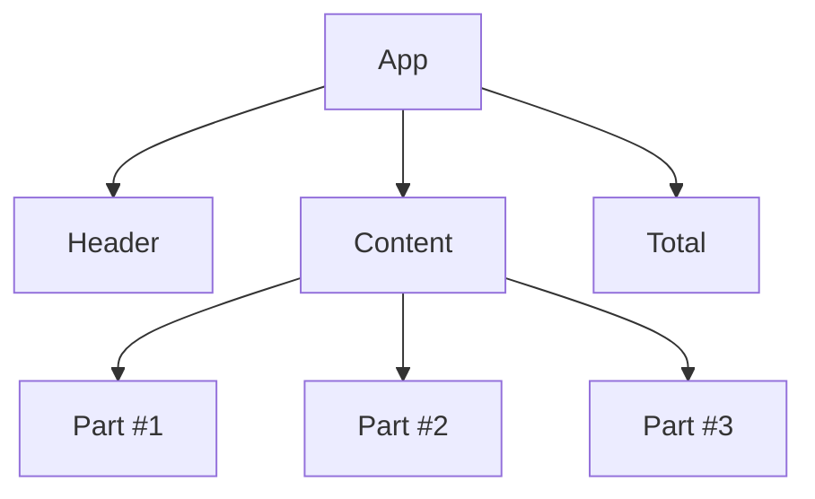
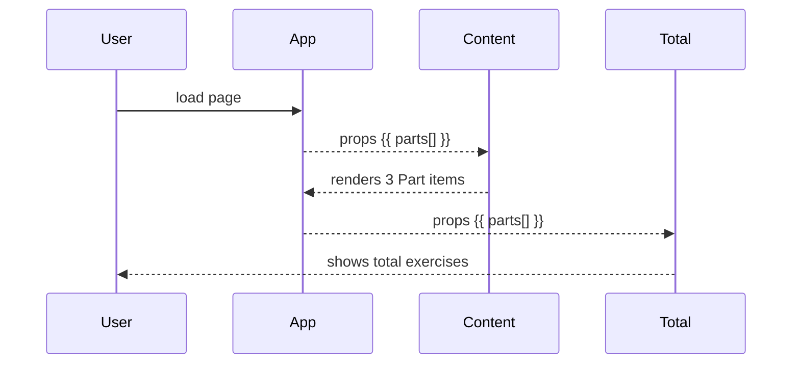
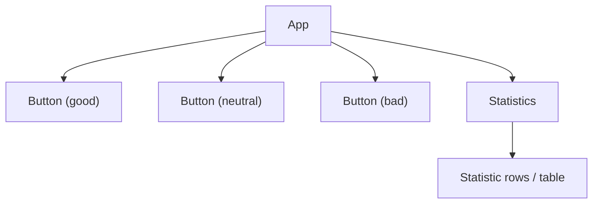
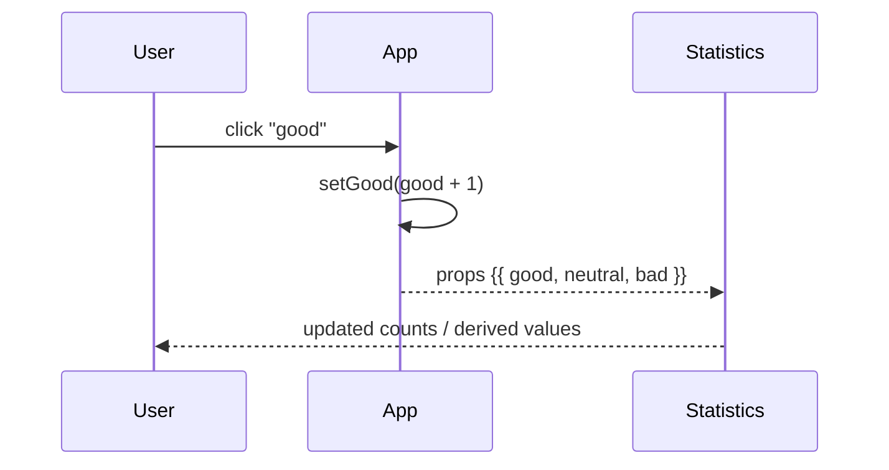
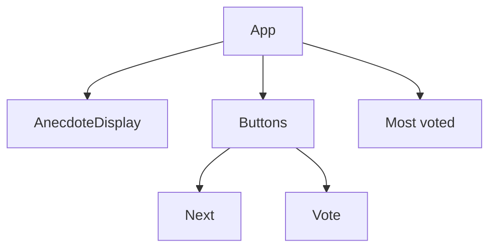
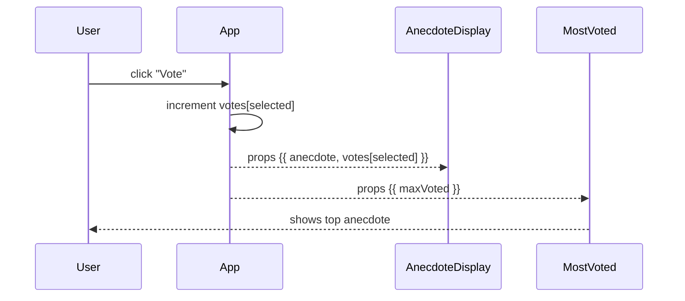

# Part 1 — Proof Diagrams (Courseinfo, Unicafe, Anecdotes) — 2025-10-01

This single notes file collects **Mermaid diagrams** that “prove” behavior for **Full Stack Open — Part 1 (a–d)**.
Copy/paste these into your repo or keep them here and link from your daily README.

---

## How to read / render
- Put each diagram in a fenced code block starting with `mermaid`.
- Keep one statement per line and, for flowcharts, end each line with `;` (safe habit).
- If labels have parentheses or punctuation, wrap them in quotes, e.g. `["Vote (click)"]`.

---

## A) courseinfo (ex. 1.1–1.5)

### Component tree


### Data model (optional)
```mermaid
classDiagram
  class Part {{
    name : string
    exercises : number
  }}
  class Course {{
    name : string
    parts : Part[]
  }}
  Course "1" --> "3" Part : props.parts
```

### Render flow


---

## B) unicafe (ex. 1.6–1.11)

### Component tree


### Click → state → re-render


---

## C) anecdotes (ex. 1.12–1.14)

### Component tree


### Interaction flow


---

## Checklists (tick as you go)
- [ ] 1.1 Courseinfo — single component renders title + parts + total
- [ ] 1.2 Courseinfo — split into Header, Content, Total
- [ ] 1.3–1.5 Courseinfo — pass data via props; compute totals
- [ ] 1.6–1.8 Unicafe — three buttons + counts
- [ ] 1.9–1.11 Unicafe — derived stats (average, positive %), table
- [ ] 1.12 Anecdotes — next anecdote
- [ ] 1.13 Anecdotes — votes
- [ ] 1.14 Anecdotes — most voted

---

## Commit suggestion
```bash
docs(notes): add Part 1 Mermaid proof diagrams (courseinfo, unicafe, anecdotes)
```
