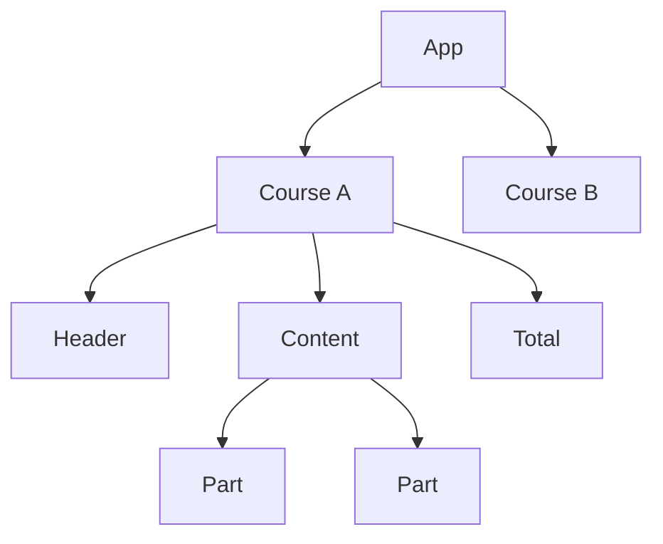
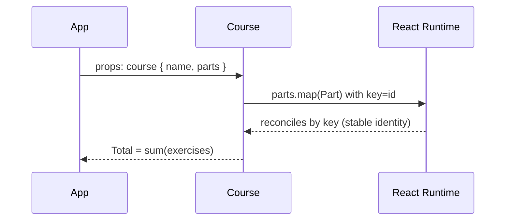

# Day Study Log — Part 2a: Rendering a collection, modules — 2025-10-02

Repository: **itsnothuy/FullStackOpen-Dairy**  
Course: [Full Stack Open → Part 2a](https://fullstackopen.com/en/part2/rendering_a_collection_modules)

---

## What I accomplished today
- ✅ Finished **Part 2a** and verified examples in a local sandbox for **courseinfo** continuation.  
- ✅ Practiced **rendering arrays** with `map`, assigned **stable keys**, and extracted small components.  
- ✅ Split code into **modules** (default vs named exports), and created a `components/` directory.  
- ✅ Captured Mermaid proofs for **component tree** and **data list rendering flow**.  
- ✅ Logged TIL bullets and wrote a self‑quiz for tomorrow’s retrieval practice.

---

## Repro steps (so anyone can verify what I did)
> You can drop these into a Vite React app or use the `part2-starters.zip` I generated below.

### 1) Render a collection (parts of a course)
```jsx
// src/App.jsx
import Course from "./components/Course"

const course = {
  id: 1,
  name: "Half Stack application development",
  parts: [
    { id: 1, name: "Fundamentals of React", exercises: 10 },
    { id: 2, name: "Using props to pass data", exercises: 7 },
    { id: 3, name: "State of a component", exercises: 14 }
  ]
}

export default function App() {
  return <Course course={course} />
}
```

```jsx
// src/components/Course.jsx
const Header = ({ name }) => <h2>{name}</h2>

const Part = ({ name, exercises }) => (
  <p>{name} {exercises}</p>
)

const Content = ({ parts }) => (
  <div>
    {parts.map(p => <Part key={p.id} name={p.name} exercises={p.exercises} />)}
  </div>
)

const Total = ({ parts }) => (
  <strong>total of {parts.reduce((sum, p) => sum + p.exercises, 0)} exercises</strong>
)

export default function Course({ course }) {
  return (
    <section>
      <Header name={course.name} />
      <Content parts={course.parts} />
      <Total parts={course.parts} />
    </section>
  )
}
```

**Why the `key` matters:** it tells React **which list item is which** across renders. Use a **stable, unique id**, not the `index` (unless the list never reorders and is static).

### 2) Multiple courses
```jsx
// src/App.jsx
import Course from "./components/Course"

const courses = [
  {
    id: 1,
    name: "Half Stack application development",
    parts: [
      { id: 1, name: "Fundamentals of React", exercises: 10 },
      { id: 2, name: "Using props to pass data", exercises: 7 },
      { id: 3, name: "State of a component", exercises: 14 }
    ]
  },
  {
    id: 2,
    name: "Node.js",
    parts: [
      { id: 1, name: "Routing", exercises: 3 },
      { id: 2, name: "Middlewares", exercises: 7 }
    ]
  }
]

export default function App() {
  return (
    <main>
      <h1>Web development curriculum</h1>
      {courses.map(c => <Course key={c.id} course={c} />)}
    </main>
  )
}
```

### 3) Modules — default vs named exports
```jsx
// src/components/index.js
export { default as Course } from "./Course"
export const version = "part2a"
```

```jsx
// src/App.jsx
import { Course, version } from "./components"
```

> **Tip:** co-locate small components by feature folder (`components`, `pages`) and export from an `index.js` barrel when it feels ergonomic. Keep modules **small** and **purposeful**.

---

## Mermaid evidence

### A) Component tree (multi-course)


### B) List rendering flow


---

## Today’s TIL (highlights)
- Prefer a **stable id** for `key` (not `index`) so React can reconcile items correctly across insertions/removals.  
- Extract small presentation components (`Header`, `Part`, `Total`) to keep `Course` readable.  
- **Barrel files** (e.g., `components/index.js`) make imports tidy; but don’t over‑abstract—opt in only when it helps.  
- Do **not** compute and store derived totals in state—**derive** them during render (`reduce`).

---

## Self‑quiz (answer tomorrow from memory)
1) Why can using `index` as a `key` cause subtle UI bugs when reordering?  
2) When would you create a separate `Course` component vs keeping logic in `App`?  
3) Show three ways to sum exercises across parts—plain loop, `reduce`, and `map`+`reduce`.  
4) Write a tiny `components/index.js` **barrel** and import from it.  
5) “Derived state is a smell.” Give an example from `Total` above.

---

## Commit suggestions
```bash
docs(part2): add detailed Part 2a day log (rendering collection + modules) with diagrams
feat(courseinfo): extract Course + Header/Content/Total; render multiple courses
chore(components): add barrel export (index.js)
```

---

## References (for repo readers)
- FSO — **Part 2a: Rendering a collection, modules** (official)  
  https://fullstackopen.com/en/part2/rendering_a_collection_modules
- FSO — **Part 2 overview** (what’s in a–e)  
  https://fullstackopen.com/en/part2
- React docs — **Rendering lists** (keys, reconciliation), **Conditional rendering**  
  https://react.dev/learn/rendering-lists  
  https://react.dev/learn/conditional-rendering
