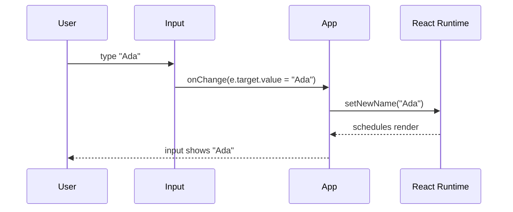
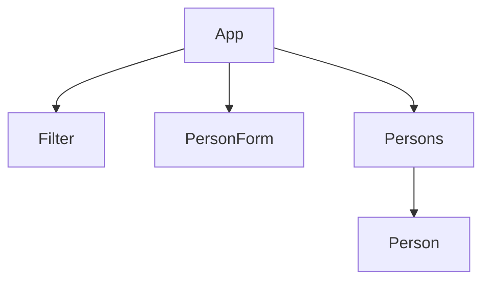

# Day Study Log — Part 2b: Forms — 2025-10-02

Repository: **itsnothuy/FullStackOpen-Dairy**  
Course: [Full Stack Open → Part 2b](https://fullstackopen.com/en/part2/forms)

---

## What I accomplished today
- ✅ Finished **Part 2b — Forms** and reproduced all examples locally.  
- ✅ Built **controlled inputs** for Phonebook (name + number) and a **submit handler** with `event.preventDefault()`.  
- ✅ Implemented **duplicate-prevention** (case-insensitive) with a friendly `alert` message.  
- ✅ Added a **filter** input (case-insensitive) and derived `personsToShow`.  
- ✅ Refactored into **Filter**, **PersonForm**, **Persons**, and **Person** components (parent holds state + handlers).  
- ✅ Logged proof diagrams and created a self‑quiz for retrieval practice tomorrow.

---

## Repro steps (verify on your machine)
> You can paste these into the `part2/phonebook` scaffold I gave you earlier (or any Vite + React app).

### 1) Single-file version (get it working first)
**`src/App.jsx`**
```jsx
import { useState } from 'react'

export default function App() {
  const [persons, setPersons] = useState([
    { id: 1, name: 'Arto Hellas', number: '040-123456' },
    { id: 2, name: 'Ada Lovelace', number: '39-44-5323523' },
  ])
  const [newName, setNewName] = useState('')
  const [newNumber, setNewNumber] = useState('')
  const [filter, setFilter] = useState('')

  const handleSubmit = (e) => {
    e.preventDefault() // stop page reload

    const exists = persons.some(
      p => p.name.trim().toLowerCase() === newName.trim().toLowerCase()
    )
    if (exists) {
      alert(`"${newName}" is already added to phonebook`) // friendly message
      return
    }

    const person = {
      id: Date.now(), // ok in a demo; server will generate ids later
      name: newName.trim(),
      number: newNumber.trim(),
    }
    setPersons(prev => prev.concat(person))
    setNewName('')
    setNewNumber('')
  }

  const personsToShow = persons.filter(p =>
    p.name.toLowerCase().includes(filter.toLowerCase())
  )

  return (
    <main style={{ fontFamily: 'system-ui, sans-serif', lineHeight: 1.5 }}>
      <h1>Phonebook</h1>

      <div style={{ marginBottom: 12 }}>
        filter shown with{' '}
        <input value={filter} onChange={e => setFilter(e.target.value)} />
      </div>

      <h2>Add a new</h2>
      <form onSubmit={handleSubmit}>
        <div>name: <input value={newName} onChange={e => setNewName(e.target.value)} /></div>
        <div>number: <input value={newNumber} onChange={e => setNewNumber(e.target.value)} /></div>
        <button type="submit" style={{ marginTop: 8 }}>add</button>
      </form>

      <h2>Numbers</h2>
      <ul>
        {personsToShow.map(p => (
          <li key={p.id}>{p.name} {p.number}</li>
        ))}
      </ul>
    </main>
  )
}
```

**Why this matches 2b concepts**
- **Controlled inputs** wire `value` to state and `onChange` to set state so the component is the single source of truth.  
- Submitting a form via `onSubmit` uses **`event.preventDefault()`** to block the browser’s default full-page submit.  
- `personsToShow` is **derived** (don’t store it in state).  
- Use **`concat`** or spread to add a person (immutability).

### 2) Refactor to components (2.10)
Create a `src/components/` folder and add three leaf components. Keep **all state** and **handlers** in `App`.

**`src/components/Filter.jsx`**
```jsx
export default function Filter({ value, onChange }) {
  return (
    <div style={{ marginBottom: 12 }}>
      filter shown with <input value={value} onChange={onChange} />
    </div>
  )
}
```

**`src/components/PersonForm.jsx`**
```jsx
export default function PersonForm({
  onSubmit,
  name,
  number,
  onNameChange,
  onNumberChange,
}) {
  return (
    <form onSubmit={onSubmit}>
      <div>name: <input value={name} onChange={onNameChange} /></div>
      <div>number: <input value={number} onChange={onNumberChange} /></div>
      <button type="submit" style={{ marginTop: 8 }}>add</button>
    </form>
  )
}
```

**`src/components/Persons.jsx`**
```jsx
export function Person({ person }) {
  return <li>{person.name} {person.number}</li>
}

export default function Persons({ persons }) {
  return (
    <ul>
      {persons.map(p => <Person key={p.id} person={p} />)}
    </ul>
  )
}
```

**`src/App.jsx` (refactored)**
```jsx
import { useState } from 'react'
import Filter from './components/Filter'
import PersonForm from './components/PersonForm'
import Persons from './components/Persons'

export default function App() {
  const [persons, setPersons] = useState([
    { id: 1, name: 'Arto Hellas', number: '040-123456' },
    { id: 2, name: 'Ada Lovelace', number: '39-44-5323523' },
  ])
  const [newName, setNewName] = useState('')
  const [newNumber, setNewNumber] = useState('')
  const [filter, setFilter] = useState('')

  const handleSubmit = (e) => {
    e.preventDefault()
    const exists = persons.some(
      p => p.name.trim().toLowerCase() === newName.trim().toLowerCase()
    )
    if (exists) {
      alert(`"${newName}" is already added to phonebook`)
      return
    }
    setPersons(prev => prev.concat({
      id: Date.now(),
      name: newName.trim(),
      number: newNumber.trim(),
    }))
    setNewName('')
    setNewNumber('')
  }

  const personsToShow = persons.filter(p =>
    p.name.toLowerCase().includes(filter.toLowerCase())
  )

  return (
    <main style={{ fontFamily: 'system-ui, sans-serif', lineHeight: 1.5 }}>
      <h1>Phonebook</h1>

      <Filter value={filter} onChange={e => setFilter(e.target.value)} />

      <h2>Add a new</h2>
      <PersonForm
        onSubmit={handleSubmit}
        name={newName}
        number={newNumber}
        onNameChange={e => setNewName(e.target.value)}
        onNumberChange={e => setNewNumber(e.target.value)}
      />

      <h2>Numbers</h2>
      <Persons persons={personsToShow} />
    </main>
  )
}
```

---

## Mermaid evidence

### A) Controlled input → state update → render


### B) Component tree after refactor (2.10)


---

## Today’s TIL (highlights)
- **Controlled components**: input `value` mirrors state; update with `onChange`.  
- Use **`onSubmit`** on `<form>` and call **`event.preventDefault()`** to stop navigation.  
- Keep derived data **out** of state (e.g., `personsToShow`).  
- Prefer **strict equality (`===`)** over `==` to avoid coercion surprises.  
- For list rendering, prefer **stable `key`** (an id).  
- Keep child components **stateless/presentational** when possible; parent manages state + handlers.

---

## Self‑quiz (answer from memory tomorrow)
1) What exactly makes an input “controlled”, and why is it useful for validation?  
2) Why is `onSubmit` + `preventDefault()` preferred over `onClick` on the button?  
3) Show two duplicate‑prevention strategies (case‑sensitive vs case‑insensitive).  
4) Why is `personsToShow` *derived* instead of stored in state?  
5) Where can component definitions live and why (tie back to “don’t define components inside components”)?

---

## Commit suggestions
```bash
docs(part2): add detailed Part 2b day log (forms) with diagrams
feat(phonebook): add controlled inputs + duplicate check + filter
refactor(phonebook): extract Filter/PersonForm/Persons, parent owns state
```

---

## References (for repo readers)
- **Full Stack Open — Part 2b: Forms** (official, the basis of this log).  
  https://fullstackopen.com/en/part2/forms
- React — **Controlled inputs** (`<input value={...} onChange={...}>`).  
  https://react.dev/reference/react-dom/components/input
- React — **Responding to events** (`onSubmit`, handler patterns).  
  https://react.dev/learn/responding-to-events
- MDN — **`event.preventDefault()`** and **form `submit` event**.  
  https://developer.mozilla.org/en-US/docs/Web/API/Event/preventDefault  
  https://developer.mozilla.org/en-US/docs/Web/API/HTMLFormElement/submit_event
- MDN — **Template literals** (for readable `alert` messages).  
  https://developer.mozilla.org/en-US/docs/Web/JavaScript/Reference/Template_literals
- MDN — **Array `filter()`** (non‑mutating).  
  https://developer.mozilla.org/en-US/docs/Web/JavaScript/Reference/Global_Objects/Array/filter
- MDN — **Equality comparisons** (`===` vs `==`).  
  https://developer.mozilla.org/en-US/docs/Web/JavaScript/Guide/Equality_comparisons_and_sameness
- React DevTools — Inspect components, props, state.  
  https://react.dev/learn/react-developer-tools
