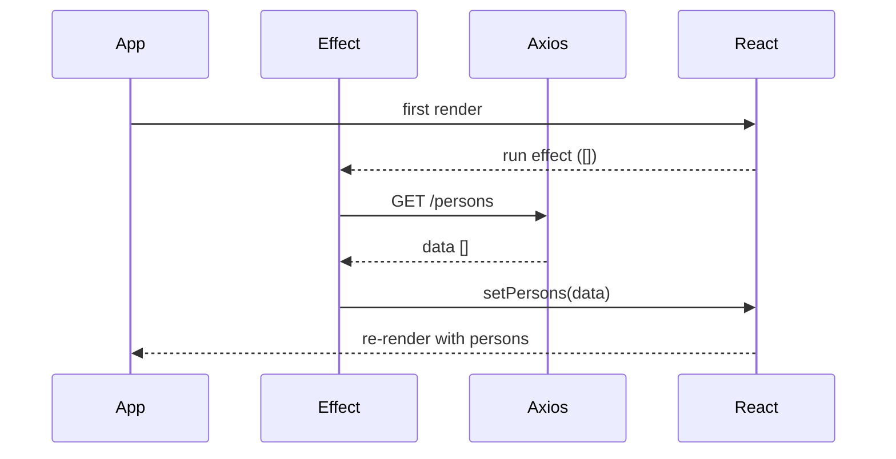
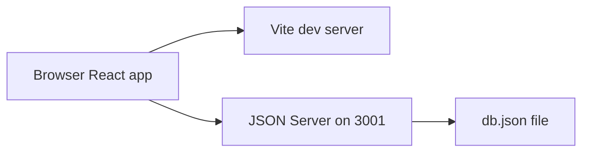

# Day Study Log — Part 2c: Getting data from server — 2025-10-02

Repository: **itsnothuy/FullStackOpen-Dairy**  
Course: [Full Stack Open → Part 2c](https://fullstackopen.com/en/part2/getting_data_from_server)

---

## What I accomplished today
- ✅ Finished **Part 2c — Getting data from server** and verified with a local JSON Server.
- ✅ Switched the Phonebook to load initial data from **`json-server`** via **Axios** inside **`useEffect`**.
- ✅ Moved HTTP code into a **service module** (`services/persons.js`) returning `res.data`.
- ✅ Captured Mermaid diagrams for **effect lifecycle** and **dev runtime architecture**.
- ✅ Wrote a self‑quiz for retrieval practice.

---

## Repro steps (verify on your machine)

> You can run this inside the starter I provided earlier at `part2/phonebook/`.

### 1) Start a mock API with JSON Server
In `part2/phonebook/server/db.json` make sure you have starter data:
```json
{
  "persons": [
    { "id": 1, "name": "Arto Hellas", "number": "040-123456" },
    { "id": 2, "name": "Ada Lovelace", "number": "39-44-5323523" }
  ]
}
```

From the `part2/phonebook` folder:
```bash
npm run server       # runs: json-server --watch server/db.json --port 3001
# visit http://localhost:3001/persons to verify JSON
```

### 2) Install Axios (if not already)
```bash
npm i axios
```

### 3) Service module pattern (clean API calls)
**`src/services/persons.js`**
```js
import axios from 'axios'
const baseUrl = import.meta.env.VITE_API_BASE_URL || 'http://localhost:3001/persons'

export const getAll = async () => (await axios.get(baseUrl)).data
export const create = async (newPerson) => (await axios.post(baseUrl, newPerson)).data
export const update = async (id, updated) => (await axios.put(`$${'{'}baseUrl{'}'}/${'$'}{id}`, updated)).data
export const remove = async (id) => { await axios.delete(`$${'{'}baseUrl{'}'}/${'$'}{id}`); return id }

export default { getAll, create, update, remove }
```

### 4) Fetch initial data with `useEffect`
**`src/App.jsx`**
```jsx
import { useEffect, useState } from 'react'
import personService from './services/persons'

export default function App() {
  const [persons, setPersons] = useState([])
  const [newName, setNewName] = useState('')
  const [newNumber, setNewNumber] = useState('')
  const [filter, setFilter] = useState('')

  // runs after first render; fetch initial persons
  useEffect(() => {
    personService.getAll().then(setPersons)
  }, [])

  const handleSubmit = (e) => {
    e.preventDefault()
    if (persons.some(p => p.name.trim().toLowerCase() === newName.trim().toLowerCase())) return alert(`"${newName}" is already added to phonebook`)
    personService.create({ name: newName.trim(), number: newNumber.trim() }).then(created => {
      setPersons(prev => prev.concat(created))
      setNewName(''); setNewNumber('')
    })  // errors will be handled in 2d
  }

  const personsToShow = persons.filter(p => p.name.toLowerCase().includes(filter.toLowerCase()))

  return (
    <main>
      <h1>Phonebook</h1>
      <div>filter shown with <input value={filter} onChange={e => setFilter(e.target.value)} /></div>

      <h2>Add a new</h2>
      <form onSubmit={handleSubmit}>
        <div>name: <input value={newName} onChange={e => setNewName(e.target.value)} /></div>
        <div>number: <input value={newNumber} onChange={e => setNewNumber(e.target.value)} /></div>
        <button type="submit">add</button>
      </form>

      <h2>Numbers</h2>
      <ul>
        {personsToShow.map(p => <li key={p.id}>{p.name} {p.number}</li>)}
      </ul>
    </main>
  )
}
```

### 5) Why `useEffect` + empty deps
Effects **synchronize** the component with external systems (servers). With an **empty dependency array `[]`**, the effect runs **only after the first render**, which is perfect for initial fetch.


---

## Mermaid evidence

### A) Effect → Axios → setState → re-render


### B) Dev runtime architecture (local)


---

## Today’s TIL (highlights)
- **Axios returns a promise**; the useful payload lives on **`res.data`**.
- `useEffect(setup, [])` runs **after** the first render; perfect for initial fetches.
- Keep HTTP code in a **service module**; components stay declarative.
- Mock backends with **JSON Server** for fast local iteration.
- Don’t store derived lists in state; **filter** during render.

---

## Self‑quiz (answer from memory tomorrow)
1) Why do we fetch in `useEffect` instead of during render?  
2) What happens if you forget the dependency array on the initial fetch effect?  
3) Show how to **POST** a new person and then update UI without a reload.  
4) Where does Axios put the JSON response and why?  
5) How can you swap the base URL using an env var in Vite?

---

## Commit suggestions
```bash
docs(part2): add detailed Part 2c day log (fetch with useEffect + Axios + JSON Server)
feat(phonebook): fetch initial persons from server; move HTTP to services/persons.js
```

---

## References (for repo readers)
- Full Stack Open — **Part 2c Getting data from server**: https://fullstackopen.com/en/part2/getting_data_from_server  
- React docs — **useEffect**: https://react.dev/reference/react/useEffect  
- Axios docs — **Intro** and **API**: https://axios-http.com/docs/intro , https://axios-http.com/docs/api_intro  
- JSON Server — npm: https://www.npmjs.com/package/json-server  
- Event loop background (optional): https://developer.mozilla.org/en-US/docs/Web/JavaScript/EventLoop
